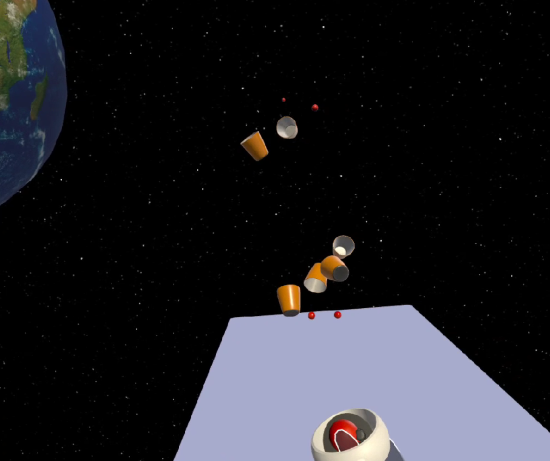

# xr-rancho
Proyecto integrador de la carrera Tec. en Desarrollo de Software

## Sobre el proyecto
Es una experiencia de realidad virtual para Meta Quest 2 y 3 donde podemos embocar pelotitas de ping pong dentro de unos vasos de plástico, similar al popular juego social 'beer pong'. La particularidad es que estamos en el espacio, cerca de la tierra y la luna. Si desactivamos la gravedad, los vasos flotan en el espacio y podemos apuntarles con las pelotitas mientras giran en el vacío.

El juego está hecho en Unity utilizando el Interaction SDK de Meta, con unos pocos scripts c# custom y assets gratuitos de la tienda de Unity.

## Releases
Las versiones que voy subiendo en este repositorio tienen su propio releases tag y se puede descargar el archivo .apk

## Promo page
Este repositorio contiene un sitio SPA del tipo promo page, donde contamos de qué va el juego con links de descarga a las distintas releases. El sitio es parte del trabajo práctico, ya que tiene algunas de las características que son necesarias para la materia:

- ABM
- Base de datos
- Login

## Stack
El promo site está hecho en Nextjs con TypeScript. La base de datos (que también proporciona la funcionalidad de login) es de Supabase.

## Deploy
Vía vercel: https://xr-rancho.vercel.app/

## Disponible en Sidequest Store
Link de la página de distribución: https://sidequestvr.com/app/38206/space-pong

## Atribuciones

- Foto de <a href="https://unsplash.com/es/@leonidasph?utm_content=creditCopyText&utm_medium=referral&utm_source=unsplash">Adrià García Sarceda</a> en <a href="https://unsplash.com/es/fotos/una-mujer-sosteniendo-un-controlador-de-videojuegos-en-la-mano-O560d5Mnc04?utm_content=creditCopyText&utm_medium=referral&utm_source=unsplash">Unsplash</a>

- Foto de <a href="https://unsplash.com/es/@ianebaldwin?utm_content=creditCopyText&utm_medium=referral&utm_source=unsplash">Ian Baldwin</a> en <a href="https://unsplash.com/es/fotos/huevos-azules-en-el-nido-SastSwWtap0?utm_content=creditCopyText&utm_medium=referral&utm_source=unsplash">Unsplash</a>

- Foto de <a href="https://unsplash.com/es/@nasa?utm_content=creditCopyText&utm_medium=referral&utm_source=unsplash">NASA</a> en <a href="https://unsplash.com/es/fotos/satelite-volando-en-el-espacio-8Hjx3GNZYeA?utm_content=creditCopyText&utm_medium=referral&utm_source=unsplash">Unsplash</a>

- Música de fondo: <a href="https://archive.org/details/gustav-holst-the-planets-op.-32">Gustav Holst, The Planets, Op. 32</a> 